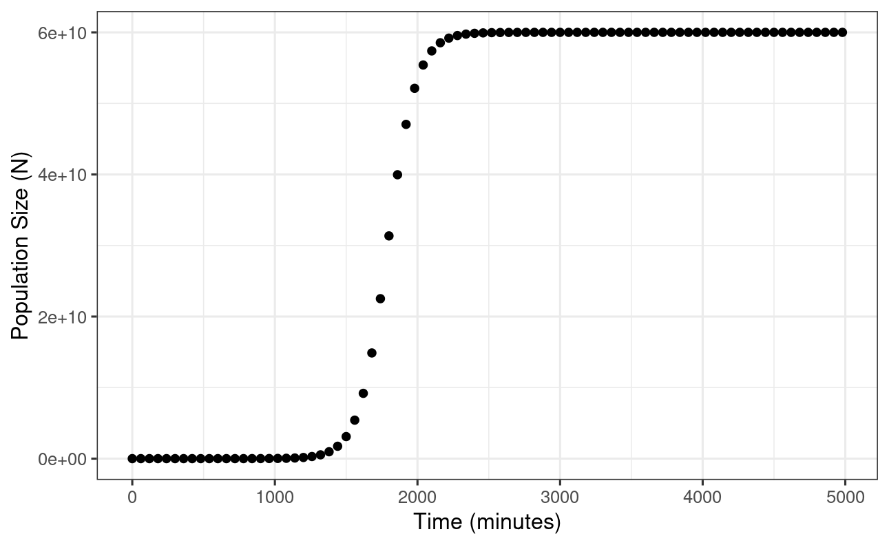
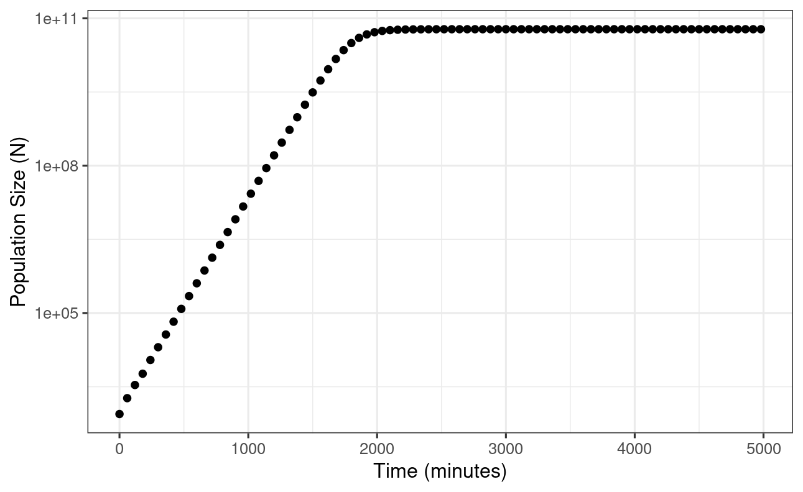
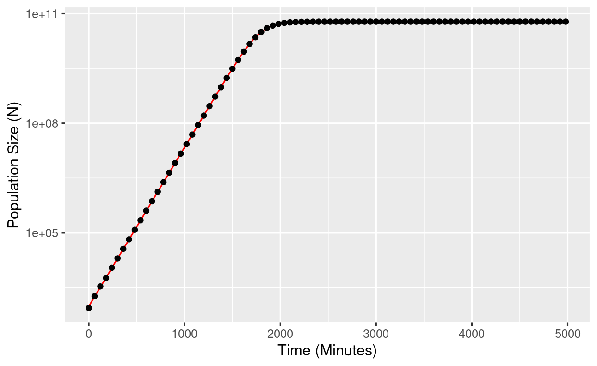
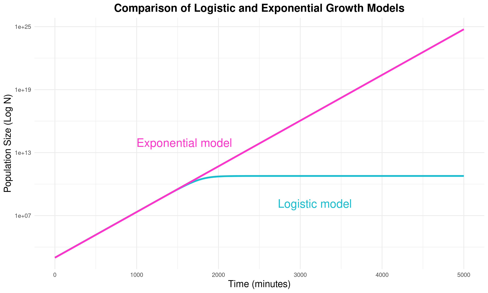

- We are given a test tube containing 900 μl of growth media and 100 μl of Escherichia coli isolate, making a total volume of 1 ml.
- The bacteria initially multiply rapidly due to the abundance of resources in the test tube. As resources become scarce, the growth rate decreases, and the population eventually stabilises at the carrying capacity.
- The aim of this experiment is to estimate the initial population size, the growth rate, and the carrying capacity of the bacteria using experimental data.

## **Question 1: Analysis**

1.  **Plot the data**

    When plotting the raw data with time in minutes on the x-axis (t) and the number of cells (N) on the y-axis, a characteristic S-shaped logistic growth curve is produced. The graph plateaus as it approaches the carrying capacity.

To look at the growth more easily over time, we can make a semi-log plot. This involves applying a logarithmic transformation to the y variable (population size). By doing this we produce a graph with a linear relationship between population size and time, which is easier to interpret. This graph reveals a steady initial increase in growth rate, which slows as the population size approaches it carrying capacity and levels off.

2.  **Fit linear model**

To estimate the initial population size ($N_0$), carrying capacity ($K$), and growth rate ($r$), we can fit a linear model, by making some assumptions:

**Assumption 1:** $K \gg N_0$ **and** $t$ **is small**

When the initial population size ($N_0$) is significantly smaller than the carrying capacity ($K$), the population initially grows exponentially. This is seen when $t$ is small (e.g., $t < 1250$). By using this assumption we can simplify the logistic growth equation

$$
N(t) = \frac{K N_0 e^{rt}}{K - N_0 + N_0 e^{rt}}
$$

to

$$
\ln(N) = \ln(N_0) + rt
$$

This is equivalent to a straight-line equation of the form:

$$
y = c + mx
$$

By fitting a linear model we can estimate the intercept, $\ln(N_0)$, and the slope, $r$:

- $r$ = 1.002e-2 = 0.01002

- $\ln(N_0)$ = 6.888

- Therefore, $N_0$ = $e^{6.888}$ = 980.44

**Assumption 2: $N(t) = K$**

As time ($t$) approaches infinity, the population size $N(t)$ can be assumed to reach the carrying capacity $K$. In this model, we use $t > 2250$ as this is the point when the population size begins to level off in the logistic growth curve.

To approximate this using a linear model, we can represent it as:

$$
N(t) = K + 0.t
$$

Here $y$ corresponds to $N(t)$, which remains constant and does not depend on any other variable. Therefore, when we are constructing a linear model, the x-variable is set to 1, and there is no gradient as the population size is not changing. The linear model’s intercept will represent the carrying capacity ($K$):

- $$K = 5.979 \times 10^{10}$$

3.  **Plot data and assess the fit of the model**

    The estimates derived from these linear approximations can now be used to create a logistic growth model. We can then compare this to the actual growth data plotted in Step 1. By plotting the log-transformed data, we can compare the model with the observed data.

    

4.  **Results**

    Based on the estimates and fitting of the logistic growth model, we derived the key parameters:

    - The estimated initial population size is $N_0$ = $e^{6.888}$ = 980.44.

    - The esitmated growth rate is $r = 0.001002$.

    - The estimated carrying capacity is $K = 5.979 \times 10^{10}$.

    **Model Fit to the Data:**

    The logistic growth model was plotted with the actual growth data to assess its fit. The black points represent the observed population growth, while the red curve represents the model's predictions using the estimated parameters.

    1.  Exponential Growth Phase:\
        In the early stages, the population exhibits exponential growth, with the model's predictions closely following the observed data points.

    2.  Plateau at Carrying Capacity:\
        As time progresses and the population approaches the carrying capacity, the growth rate slows. The model follows this transition, with the red line closely aligning with the data points as it approaches the asymptote.

## Question 2: Predicting Population Size Under Exponential Growth

An exponential growth model is represented by the equation:

$$
N(t) = N_0 e^{rt}
$$

We can substitute the parameter values we derived from our linear model into the exponential growth formula:

-   Initial population size ($N_0$): $e^{6.888}$ = 980.44
-   Growth rate ($r$): 0.01002

$$N(t) = 980.44 \times e^{0.01002 \times 4980}$$ = $$N(t) = 4.598 \times 10^{24}$$

This result shows that, under exponential growth, the population size would theoretically reach $4.598 \times 10^{24}$ at $t = 4980$ minutes. However, this is unrealistic because in reality resources are limited.

**Comparison with the Logistic Growth Model**

For the logistic growth model, which accounts for a carrying capacity and resource limitation, the equation used is:

$$
N(t) = \frac{K N_0 e^{rt}}{K - N_0 + N_0 e^{rt}}
$$

We can substitute our parameters derived from the linear models into the logistic equation:

-   Initial population size ($N_0$): $e^{6.888}$
-   Growth rate ($r$): 0.01002
-   Carrying capacity ($K$): $5.979 \times 10^{10}$

$$N(t) = \frac{(5.979 \times 10^{10}) \times (e^{6.888}) \times (e^{0.01002 \times 4980})}{(5.979 \times 10^{10}) - (e^{6.888}) + (e^{6.888} \times e^{0.01002 \times 4980})}$$ = $$N(t) = 5.979 \times 10^{10} = K$$

**Interpretation of the Results**

1.  Exponential Growth:
    -   Under exponential growth, the population continues to grow unchecked. At the $t = 4980$ minutes, the population size would reach $4.598 \times 10^{24}$. This is because exponential growth does not consider resource limitations, leading to unsustainable growth rates.
2.  Logistic Growth:
    -   At $t = 4980$ minutes, the population has reached its carrying capacity of $5.979 \times 10^{10}$. At this point, the growth rate of the population is 0, as the environment can no longer support further growth due to limited resources.

## Question 3: Comparing Exponential and Logistic Growth Curves
Code can be found in compare_growth_models.R in repository.

